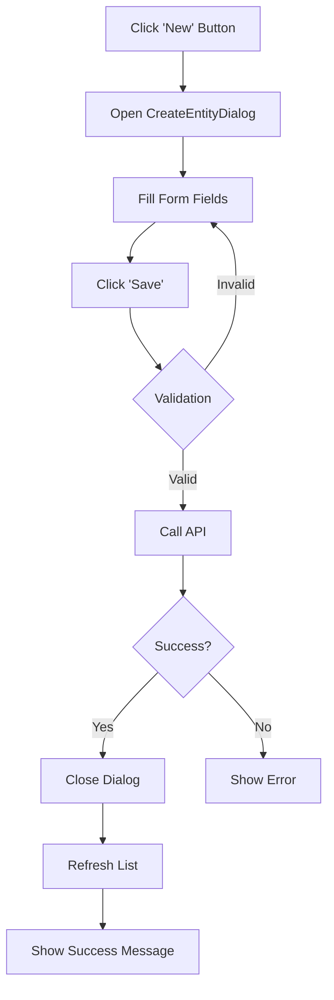
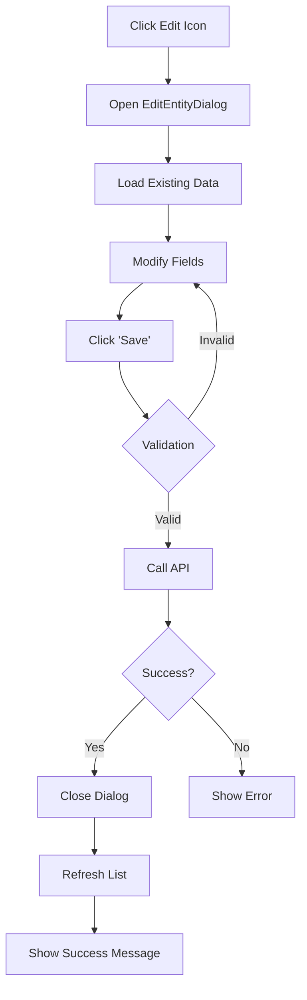
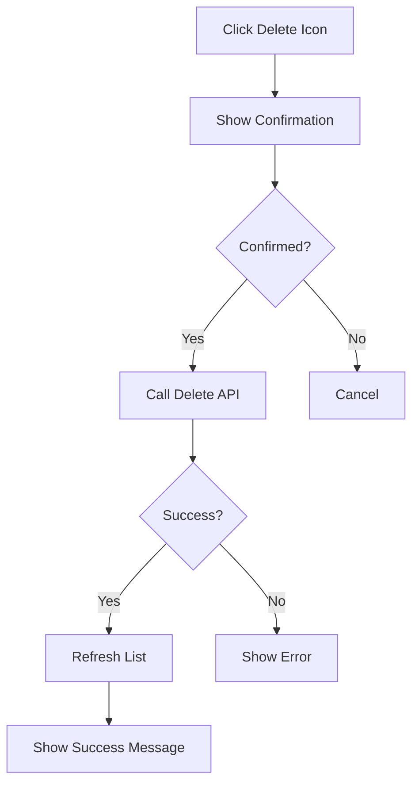

# Feature Documentation Template

This template defines the standard documentation structure for all features in SteelAxis.

---

## 📁 Required Folder Structure

Every feature MUST have a dedicated folder in `/docs/` with the following structure:

```
docs/
└── [feature-name]/
    ├── README.md           # Main feature documentation (what, why, how)
    ├── PLAN.md             # Implementation plan (created BEFORE coding)
    ├── API-SPEC.md         # API endpoints and contracts
    ├── DATABASE.md         # Database schema and migrations
    ├── UI.md               # UI components and pages
    └── IMPLEMENTATION.md   # Implementation details and decisions
```

---

## 📝 File Templates

### **PLAN.md** - Created BEFORE Implementation

```markdown
# [Feature Name] - Implementation Plan

**Status:** Planning | In Progress | Complete  
**Created:** [Date]  
**Author:** [Name]  

## Overview
Brief description of what this feature does and why it's needed.

## Business Value
- What problem does this solve?
- Who benefits from this feature?
- What are the expected outcomes?

## User Stories
- As a [user type], I want to [action], so that [benefit]
- As a [user type], I want to [action], so that [benefit]

## Acceptance Criteria
- [ ] Criterion 1
- [ ] Criterion 2
- [ ] Criterion 3

## Technical Approach

### Architecture
- Overall architecture pattern
- Components involved
- Data flow

### API Endpoints
| Method | Endpoint | Description | Request | Response |
|--------|----------|-------------|---------|----------|
| GET | /api/entities | Get all | - | List<EntityDto> |
| GET | /api/entities/{id} | Get by ID | - | EntityDto |
| POST | /api/entities | Create | CreateRequest | EntityDto |
| PUT | /api/entities/{id} | Update | UpdateRequest | - |
| DELETE | /api/entities/{id} | Delete | - | - |

### Database Schema Changes
```sql
-- New tables
CREATE TABLE [dbo].[Entities] (
    [Id] UNIQUEIDENTIFIER PRIMARY KEY,
    [TenantId] UNIQUEIDENTIFIER NOT NULL,
    [Name] NVARCHAR(200) NOT NULL,
    [CreatedAt] DATETIME2 NOT NULL,
    [CreatedBy] NVARCHAR(256) NOT NULL
);
```

### UI Components
- **Pages:**
  - `/entities` - List view
  - `/entities/{id}` - Detail view
- **Dialogs:**
  - `CreateEntityDialog`
  - `EditEntityDialog`
- **Components:**
  - Uses `StandardDataGrid`
  - Uses `StandardDialog`

## Dependencies
- External packages required
- Service dependencies
- Database migrations
- Configuration changes

## Risks & Mitigation
| Risk | Impact | Mitigation |
|------|--------|------------|
| Data migration complexity | High | Create rollback script |
| Performance impact | Medium | Add indexes, use caching |

## Implementation Steps
1. [ ] Create entity models and DTOs
2. [ ] Create database migration
3. [ ] Implement service interface and implementation
4. [ ] Create API controller with all endpoints
5. [ ] Create HTTP service for Blazor
6. [ ] Create UI components (list, create, edit dialogs)
7. [ ] Add navigation menu items
8. [ ] Write unit tests
9. [ ] Update documentation

## Testing Strategy
- Unit tests for service layer
- Integration tests for API endpoints
- UI component tests
- Manual testing checklist

## Timeline
- Estimated effort: [X] days
- Target completion: [Date]
```

---

### **README.md** - Updated AFTER Implementation

```markdown
# [Feature Name]

**Status:** ✅ Complete | 🚧 In Progress | 📋 Planned  
**Version:** 1.0.0  
**Last Updated:** [Date]

## What

Brief description of the feature and its capabilities.

## Why

### Business Value
- Why this feature exists
- Problems it solves
- Benefits to users

### Use Cases
1. **Use Case 1:** Description
2. **Use Case 2:** Description
3. **Use Case 3:** Description

## How

### User Guide

#### Accessing the Feature
1. Navigate to [location in menu]
2. Click [button/link]
3. You will see [description]

#### Creating a New [Entity]
1. Click the "New" button
2. Fill in required fields:
   - **Field 1:** Description
   - **Field 2:** Description
3. Click "Save"

#### Editing an Existing [Entity]
1. Click the edit icon on the row
2. Modify fields
3. Click "Save"

#### Deleting a [Entity]
1. Click the delete icon
2. Confirm deletion

### Screenshots


*Caption: Main list view showing all entities*


*Caption: Create new entity dialog*

### API Documentation

See [API-SPEC.md](./API-SPEC.md) for complete API documentation.

**Quick Reference:**
- Base URL: `/api/entities`
- Authentication: Required (JWT Bearer)
- Tenant: Auto-resolved from user context

### Configuration

No additional configuration required.

**Optional Settings:**
```json
{
  "Feature": {
    "MaxItemsPerPage": 50,
    "EnableAdvancedFiltering": true
  }
}
```

### Database Schema

See [DATABASE.md](./DATABASE.md) for complete schema documentation.

### UI Components

See [UI.md](./UI.md) for UI component documentation.

## Technical Details

### Architecture
- **Pattern:** API-First with multi-tenancy
- **UI Framework:** Blazor Server with MudBlazor
- **Data Access:** Entity Framework Core
- **Authentication:** Microsoft Entra External ID

### Dependencies
- MudBlazor 8.12.0
- Entity Framework Core 8.0

### Key Files
- **Models:** `SteelAxis.Shared/Models/Entity.cs`
- **Service:** `SteelAxis.Services/Implementation/EntityService.cs`
- **Controller:** `SteelAxis.Api/Controllers/EntitiesController.cs`
- **UI Page:** `SteelAxis.Web/Components/Pages/Entities.razor`

## Known Limitations
- Limitation 1
- Limitation 2

## Future Enhancements
- [ ] Enhancement 1
- [ ] Enhancement 2

## Related Documentation
- [PLAN.md](./PLAN.md) - Original implementation plan
- [API-SPEC.md](./API-SPEC.md) - API specification
- [DATABASE.md](./DATABASE.md) - Database schema
- [UI.md](./UI.md) - UI components
```

---

### **API-SPEC.md** - API Endpoints Documentation

```markdown
# [Feature Name] - API Specification

**Base URL:** `/api/entities`  
**Authentication:** Required (JWT Bearer Token)  
**Tenant Resolution:** Automatic from authenticated user

---

## Endpoints

### 1. Get All Entities

**GET** `/api/entities`

Retrieves all entities for the current tenant.

**Request:**
```http
GET /api/entities HTTP/1.1
Authorization: Bearer {token}
```

**Response:** `200 OK`
```json
[
  {
    "id": "3fa85f64-5717-4562-b3fc-2c963f66afa6",
    "name": "Entity Name",
    "description": "Entity Description",
    "createdAt": "2025-10-27T10:00:00Z",
    "createdBy": "user@example.com"
  }
]
```

**Error Responses:**
- `401 Unauthorized` - Missing or invalid authentication token
- `500 Internal Server Error` - Server error

---

### 2. Get Entity by ID

**GET** `/api/entities/{id}`

Retrieves a specific entity by ID.

**Parameters:**
- `id` (path, required): Entity GUID

**Request:**
```http
GET /api/entities/3fa85f64-5717-4562-b3fc-2c963f66afa6 HTTP/1.1
Authorization: Bearer {token}
```

**Response:** `200 OK`
```json
{
  "id": "3fa85f64-5717-4562-b3fc-2c963f66afa6",
  "name": "Entity Name",
  "description": "Entity Description",
  "createdAt": "2025-10-27T10:00:00Z",
  "createdBy": "user@example.com"
}
```

**Error Responses:**
- `401 Unauthorized` - Missing or invalid authentication token
- `404 Not Found` - Entity not found
- `500 Internal Server Error` - Server error

---

### 3. Create Entity

**POST** `/api/entities`

Creates a new entity for the current tenant.

**Request:**
```http
POST /api/entities HTTP/1.1
Authorization: Bearer {token}
Content-Type: application/json

{
  "name": "New Entity",
  "description": "Description of the new entity"
}
```

**Request Body Schema:**
```json
{
  "name": "string (required, max 200 chars)",
  "description": "string (optional, max 1000 chars)"
}
```

**Response:** `201 Created`
```json
{
  "id": "3fa85f64-5717-4562-b3fc-2c963f66afa6",
  "name": "New Entity",
  "description": "Description of the new entity",
  "createdAt": "2025-10-27T10:00:00Z",
  "createdBy": "user@example.com"
}
```

**Error Responses:**
- `400 Bad Request` - Validation errors
- `401 Unauthorized` - Missing or invalid authentication token
- `500 Internal Server Error` - Server error

---

### 4. Update Entity

**PUT** `/api/entities/{id}`

Updates an existing entity.

**Parameters:**
- `id` (path, required): Entity GUID

**Request:**
```http
PUT /api/entities/3fa85f64-5717-4562-b3fc-2c963f66afa6 HTTP/1.1
Authorization: Bearer {token}
Content-Type: application/json

{
  "name": "Updated Entity",
  "description": "Updated description"
}
```

**Response:** `204 No Content`

**Error Responses:**
- `400 Bad Request` - Validation errors
- `401 Unauthorized` - Missing or invalid authentication token
- `404 Not Found` - Entity not found
- `500 Internal Server Error` - Server error

---

### 5. Delete Entity

**DELETE** `/api/entities/{id}`

Deletes an entity.

**Parameters:**
- `id` (path, required): Entity GUID

**Request:**
```http
DELETE /api/entities/3fa85f64-5717-4562-b3fc-2c963f66afa6 HTTP/1.1
Authorization: Bearer {token}
```

**Response:** `204 No Content`

**Error Responses:**
- `401 Unauthorized` - Missing or invalid authentication token
- `404 Not Found` - Entity not found
- `500 Internal Server Error` - Server error

---

## Data Models

### EntityDto
```csharp
public record EntityDto
{
    public Guid Id { get; init; }
    public string Name { get; init; } = string.Empty;
    public string? Description { get; init; }
    public DateTime CreatedAt { get; init; }
    public string CreatedBy { get; init; } = string.Empty;
}
```

### CreateEntityRequest
```csharp
public record CreateEntityRequest
{
    [Required]
    [StringLength(200, MinimumLength = 3)]
    public string Name { get; init; } = string.Empty;
    
    [StringLength(1000)]
    public string? Description { get; init; }
}
```

### UpdateEntityRequest
```csharp
public record UpdateEntityRequest
{
    [Required]
    [StringLength(200, MinimumLength = 3)]
    public string Name { get; init; } = string.Empty;
    
    [StringLength(1000)]
    public string? Description { get; init; }
}
```

## Testing

### Example cURL Commands

**Get All:**
```bash
curl -X GET "https://api.steelaxis.com/api/entities" \
  -H "Authorization: Bearer {token}"
```

**Create:**
```bash
curl -X POST "https://api.steelaxis.com/api/entities" \
  -H "Authorization: Bearer {token}" \
  -H "Content-Type: application/json" \
  -d '{
    "name": "Test Entity",
    "description": "Test Description"
  }'
```
```

---

### **DATABASE.md** - Database Schema Documentation

```markdown
# [Feature Name] - Database Schema

## Overview

This document describes the database schema for the [Feature Name] feature.

---

## Tables

### Entities

Stores [description of what the table stores].

**Table Name:** `Entities`  
**Tenant Scoped:** Yes (includes `TenantId`)  
**Immutable:** No

**Schema:**
```sql
CREATE TABLE [dbo].[Entities]
(
    [Id] UNIQUEIDENTIFIER NOT NULL PRIMARY KEY DEFAULT NEWID(),
    [TenantId] UNIQUEIDENTIFIER NOT NULL,
    [Name] NVARCHAR(200) NOT NULL,
    [Description] NVARCHAR(1000) NULL,
    [CreatedAt] DATETIME2 NOT NULL DEFAULT GETUTCDATE(),
    [CreatedBy] NVARCHAR(256) NOT NULL,
    [ModifiedAt] DATETIME2 NULL,
    [ModifiedBy] NVARCHAR(256) NULL,
    [IsDeleted] BIT NOT NULL DEFAULT 0,
    
    CONSTRAINT [FK_Entities_Tenants] 
        FOREIGN KEY ([TenantId]) 
        REFERENCES [dbo].[Tenants]([Id]) 
        ON DELETE CASCADE
);
```

**Indexes:**
```sql
-- Performance index for tenant queries
CREATE NONCLUSTERED INDEX [IX_Entities_TenantId] 
    ON [dbo].[Entities]([TenantId]);

-- Index for name searches
CREATE NONCLUSTERED INDEX [IX_Entities_Name] 
    ON [dbo].[Entities]([TenantId], [Name]);

-- Filtered index for active records
CREATE NONCLUSTERED INDEX [IX_Entities_Active] 
    ON [dbo].[Entities]([TenantId], [CreatedAt]) 
    WHERE [IsDeleted] = 0;
```

**Column Descriptions:**

| Column | Type | Null | Description |
|--------|------|------|-------------|
| `Id` | UNIQUEIDENTIFIER | No | Primary key |
| `TenantId` | UNIQUEIDENTIFIER | No | Multi-tenancy isolation |
| `Name` | NVARCHAR(200) | No | Entity name |
| `Description` | NVARCHAR(1000) | Yes | Optional description |
| `CreatedAt` | DATETIME2 | No | Creation timestamp (UTC) |
| `CreatedBy` | NVARCHAR(256) | No | User who created the record |
| `ModifiedAt` | DATETIME2 | Yes | Last modification timestamp (UTC) |
| `ModifiedBy` | NVARCHAR(256) | Yes | User who last modified the record |
| `IsDeleted` | BIT | No | Soft delete flag |

---

## Entity Models

### Entity.cs

```csharp
public class Entity : BaseEntity
{
    public string Name { get; set; } = string.Empty;
    public string? Description { get; set; }
    
    // Navigation properties
    public virtual ICollection<RelatedEntity> RelatedEntities { get; set; } = new List<RelatedEntity>();
}
```

**Validation Rules:**
- `Name`: Required, 3-200 characters
- `Description`: Optional, max 1000 characters

---

## Relationships

### Entity → RelatedEntity (One-to-Many)

```csharp
// In Entity.cs
public virtual ICollection<RelatedEntity> RelatedEntities { get; set; }

// In RelatedEntity.cs
public Guid EntityId { get; set; }
public virtual Entity Entity { get; set; } = null!;
```

**Foreign Key:**
```sql
ALTER TABLE [dbo].[RelatedEntities]
ADD CONSTRAINT [FK_RelatedEntities_Entities]
    FOREIGN KEY ([EntityId])
    REFERENCES [dbo].[Entities]([Id])
    ON DELETE CASCADE;
```

---

## EF Core Configuration

```csharp
public class EntityConfiguration : IEntityTypeConfiguration<Entity>
{
    public void Configure(EntityTypeBuilder<Entity> builder)
    {
        builder.ToTable("Entities");
        
        builder.HasKey(e => e.Id);
        
        builder.Property(e => e.Name)
            .IsRequired()
            .HasMaxLength(200);
        
        builder.Property(e => e.Description)
            .HasMaxLength(1000);
        
        // Index for tenant queries
        builder.HasIndex(e => e.TenantId)
            .HasDatabaseName("IX_Entities_TenantId");
        
        // Composite index for name searches
        builder.HasIndex(e => new { e.TenantId, e.Name })
            .HasDatabaseName("IX_Entities_Name");
        
        // Relationship configuration
        builder.HasMany(e => e.RelatedEntities)
            .WithOne(r => r.Entity)
            .HasForeignKey(r => r.EntityId)
            .OnDelete(DeleteBehavior.Cascade);
    }
}
```

---

## Migrations

### Initial Migration

```bash
dotnet ef migrations add Add_Entities_Table -p SteelAxis.Data -s SteelAxis.Api
dotnet ef database update -p SteelAxis.Data -s SteelAxis.Api
```

### Migration Script

```csharp
public partial class Add_Entities_Table : Migration
{
    protected override void Up(MigrationBuilder migrationBuilder)
    {
        migrationBuilder.CreateTable(
            name: "Entities",
            columns: table => new
            {
                Id = table.Column<Guid>(nullable: false),
                TenantId = table.Column<Guid>(nullable: false),
                Name = table.Column<string>(maxLength: 200, nullable: false),
                Description = table.Column<string>(maxLength: 1000, nullable: true),
                CreatedAt = table.Column<DateTime>(type: "datetime2", nullable: false),
                CreatedBy = table.Column<string>(maxLength: 256, nullable: false),
                ModifiedAt = table.Column<DateTime>(type: "datetime2", nullable: true),
                ModifiedBy = table.Column<string>(maxLength: 256, nullable: true),
                IsDeleted = table.Column<bool>(nullable: false, defaultValue: false)
            },
            constraints: table =>
            {
                table.PrimaryKey("PK_Entities", x => x.Id);
                table.ForeignKey(
                    name: "FK_Entities_Tenants",
                    column: x => x.TenantId,
                    principalTable: "Tenants",
                    principalColumn: "Id",
                    onDelete: ReferentialAction.Cascade);
            });
        
        migrationBuilder.CreateIndex(
            name: "IX_Entities_TenantId",
            table: "Entities",
            column: "TenantId");
    }
    
    protected override void Down(MigrationBuilder migrationBuilder)
    {
        migrationBuilder.DropTable(name: "Entities");
    }
}
```

---

## Seed Data

```csharp
public static class EntitySeeder
{
    public static void SeedEntities(ModelBuilder modelBuilder)
    {
        // Only seed data for development/testing
        modelBuilder.Entity<Entity>().HasData(
            new Entity
            {
                Id = Guid.Parse("11111111-1111-1111-1111-111111111111"),
                TenantId = Guid.Parse("22222222-2222-2222-2222-222222222222"),
                Name = "Sample Entity",
                Description = "This is a sample entity",
                CreatedAt = DateTime.UtcNow,
                CreatedBy = "system@steelaxis.com"
            }
        );
    }
}
```

---

## Multi-Tenancy Considerations

- **TenantId Column:** Required on all tenant-scoped tables
- **Isolation:** All queries MUST filter by `TenantId`
- **Foreign Keys:** When referencing tenant data, ensure tenant consistency
- **Indexes:** Always include `TenantId` in composite indexes for performance

---

## EN 1090 Compliance (if applicable)

- **Immutability:** [Is this data immutable? How is it enforced?]
- **Audit Trail:** [How are changes tracked?]
- **Data Integrity:** [Are data hashes used?]
- **Traceability:** [How is traceability maintained?]
```

---

### **UI.md** - UI Components Documentation

```markdown
# [Feature Name] - UI Documentation

## Overview

This document describes the user interface components for the [Feature Name] feature.

---

## Pages

### 1. Entity List Page

**Route:** `/entities`  
**Component:** `Entities.razor`  
**Access:** Authenticated users only

**Description:**  
Displays all entities for the current tenant in a data grid with search, filter, and CRUD operations.

**Features:**
- ✅ Uses `StandardDataGrid` component
- ✅ Search functionality
- ✅ Column filtering
- ✅ Sorting
- ✅ Create/Edit/Delete actions

**Screenshot:**


**Component Structure:**
```
Entities.razor
├── StandardDataGrid
│   ├── PropertyColumn (Name)
│   ├── PropertyColumn (Description)
│   ├── PropertyColumn (CreatedAt)
│   └── TemplateColumn (Actions)
```

---

## Dialogs

### 1. Create Entity Dialog

**Component:** `CreateEntityDialog.razor`  
**Trigger:** Click "New" button on list page

**Description:**  
Dialog for creating a new entity using `StandardDialog` component.

**Features:**
- ✅ Uses `StandardDialog` component
- ✅ Form validation
- ✅ Error handling
- ✅ Loading state

**Form Fields:**
| Field | Type | Required | Validation |
|-------|------|----------|------------|
| Name | Text | Yes | 3-200 characters |
| Description | TextArea | No | Max 1000 characters |

**Screenshot:**


---

### 2. Edit Entity Dialog

**Component:** `EditEntityDialog.razor`  
**Trigger:** Click edit icon on entity row

**Description:**  
Dialog for editing an existing entity.

**Features:**
- ✅ Uses `StandardDialog` component
- ✅ Pre-populated with existing data
- ✅ Form validation
- ✅ Error handling
- ✅ Loading state

**Screenshot:**


---

## Components

### MudBlazor Components Used

| Component | Usage | Location |
|-----------|-------|----------|
| `StandardDataGrid` | Entity list | Entities.razor |
| `StandardDialog` | Create/Edit forms | CreateEntityDialog.razor, EditEntityDialog.razor |
| `MudTextField` | Name input | Dialogs |
| `MudTextField` (multiline) | Description input | Dialogs |
| `MudButton` | Actions | All |
| `MudIconButton` | Row actions | Entity list |
| `MudSnackbar` | Notifications | All |

---

## State Management

### Component State

**Entities.razor:**
```csharp
private List<EntityDto> _items = new();
private bool _loading = true;
```

**Dialogs:**
```csharp
private CreateEntityRequest _model = new();
private bool _saving = false;
```

### Service Injection

```csharp
@inject IEntityHttpService HttpService
@inject IDialogService DialogService
@inject ISnackbar Snackbar
```

---

## User Interactions

### Create Flow



### Edit Flow



### Delete Flow



---

## Responsive Design

### Breakpoints

| Breakpoint | Size | Layout Changes |
|------------|------|----------------|
| xs | < 600px | Stack form fields vertically |
| sm | 600-960px | Two columns for forms |
| md | 960-1280px | Full data grid features |
| lg | 1280-1920px | Expanded data grid |
| xl | > 1920px | Maximum width container |

### Mobile Considerations

- ✅ Dialog width: Full width on mobile (`MaxWidth.Medium`, `FullWidth = true`)
- ✅ Data grid: Horizontal scroll on small screens
- ✅ Action buttons: Touch-friendly size (`Size.Small` minimum)
- ✅ Form fields: Full width on mobile (MudGrid responsive)

---

## Accessibility

### WCAG 2.1 Level AA Compliance

- ✅ **Keyboard Navigation:** All interactive elements accessible via keyboard
- ✅ **Screen Reader Support:** Proper ARIA labels on all inputs
- ✅ **Color Contrast:** Meets WCAG AA standards
- ✅ **Focus Indicators:** Visible focus states
- ✅ **Form Labels:** All inputs have associated labels
- ✅ **Error Messages:** Clearly associated with form fields

### Testing

```bash
# Run accessibility tests
npm run test:a11y
```

---

## Performance

### Optimization Strategies

- ✅ **Virtualization:** Data grid supports virtualization for large datasets
- ✅ **Debounced Search:** 500ms debounce on search input
- ✅ **Lazy Loading:** Dialogs loaded on demand
- ✅ **Efficient Re-renders:** Minimal `StateHasChanged()` calls

### Metrics

- **Initial Load:** < 1s
- **Dialog Open:** < 200ms
- **Search Response:** < 300ms
- **Create/Update/Delete:** < 500ms

---

## Navigation

### Menu Structure

```
Main Navigation
└── Administration
    └── Entities (/entities)
```

### Route Configuration

```csharp
// In NavMenu.razor
<MudNavLink Href="/entities" Icon="@Icons.Material.Filled.Category">
    Entities
</MudNavLink>
```

---

## Notifications

### Success Messages
- "Entity created successfully"
- "Entity updated successfully"
- "Entity deleted successfully"

### Error Messages
- "Error loading data: [error message]"
- "Error creating entity: [error message]"
- "Error updating entity: [error message]"
- "Error deleting entity: [error message]"

### Snackbar Configuration
- **Position:** Bottom Right
- **Duration:** 5 seconds
- **Severity:** Success (green), Error (red)

---

## Code Examples

### List Page Implementation

```csharp
@page "/entities"
@inject IEntityHttpService HttpService
@inject IDialogService DialogService
@inject ISnackbar Snackbar

<StandardDataGrid TItem="EntityDto"
                  Items="@_items"
                  Title="Entities"
                  Loading="@_loading"
                  OnCreate="@OpenCreateDialog"
                  OnEdit="@OpenEditDialog"
                  OnDelete="@DeleteItem">
    <Columns>
        <PropertyColumn Property="x => x.Name" Title="Name" />
        <PropertyColumn Property="x => x.Description" Title="Description" />
        <PropertyColumn Property="x => x.CreatedAt" Title="Created" Format="yyyy-MM-dd" />
    </Columns>
</StandardDataGrid>

@code {
    private List<EntityDto> _items = new();
    private bool _loading = true;
    
    protected override async Task OnInitializedAsync()
    {
        await LoadDataAsync();
    }
    
    private async Task LoadDataAsync()
    {
        _loading = true;
        try
        {
            _items = await HttpService.GetAllAsync();
        }
        finally
        {
            _loading = false;
        }
    }
}
```

---

## Known Issues

- None currently

---

## Future Enhancements

- [ ] Bulk operations (multi-select delete)
- [ ] Export to Excel/CSV
- [ ] Advanced filtering UI
- [ ] Real-time updates via SignalR
```

---

## 📋 Quick Reference

### Documentation Workflow

1. **Before Implementation:**
   ```bash
   # Create feature folder
   mkdir docs/[feature-name]
   
   # Create PLAN.md
   # Fill in: overview, user stories, technical approach, implementation steps
   
   # Commit plan
   git add docs/[feature-name]/PLAN.md
   git commit -m "docs: add [feature-name] implementation plan"
   ```

2. **During Implementation:**
   - Refer to PLAN.md
   - Update PLAN.md if approach changes

3. **After Implementation:**
   ```bash
   # Create all documentation files
   touch docs/[feature-name]/README.md
   touch docs/[feature-name]/API-SPEC.md
   touch docs/[feature-name]/DATABASE.md
   touch docs/[feature-name]/UI.md
   touch docs/[feature-name]/IMPLEMENTATION.md
   
   # Fill in each file using templates above
   
   # Commit documentation
   git add docs/[feature-name]/
   git commit -m "docs: complete [feature-name] documentation"
   ```

---

## ✅ Documentation Checklist

Before considering a feature complete:

- [ ] Feature folder created in `/docs/[feature-name]/`
- [ ] `PLAN.md` created and committed before implementation
- [ ] `README.md` completed with what, why, how
- [ ] `API-SPEC.md` documents all endpoints
- [ ] `DATABASE.md` documents schema and migrations
- [ ] `UI.md` documents all UI components
- [ ] `IMPLEMENTATION.md` captures key decisions
- [ ] Screenshots added where applicable
- [ ] All files committed with clear messages
- [ ] Project README.md updated with link to feature docs

---

**Remember:** Good documentation is not optional—it's a critical part of feature delivery!
