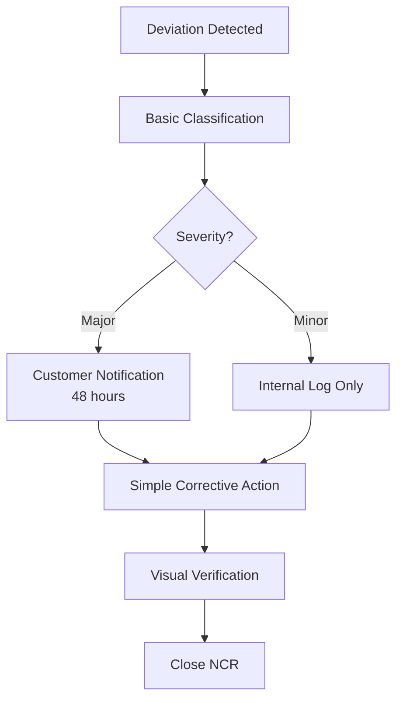
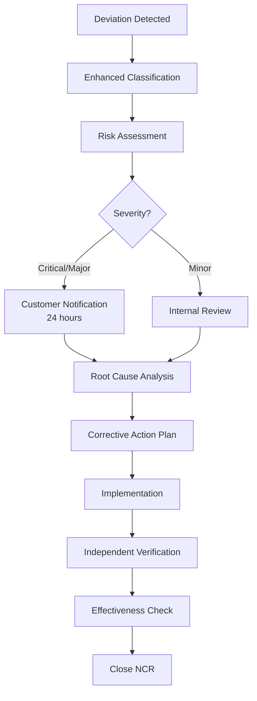
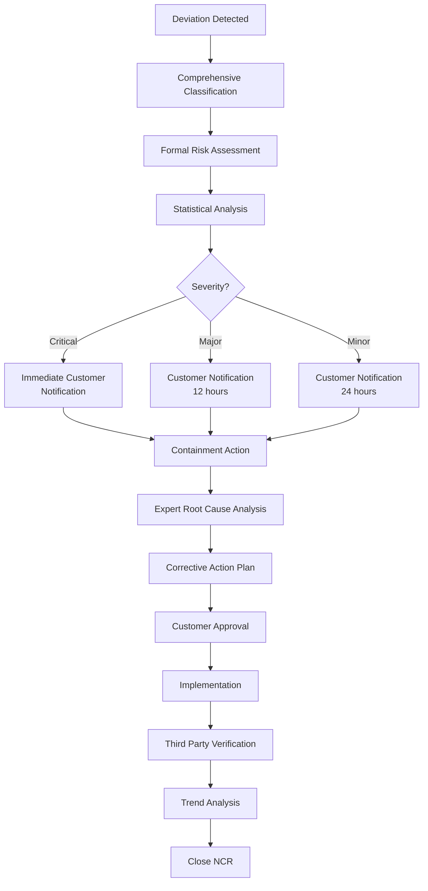
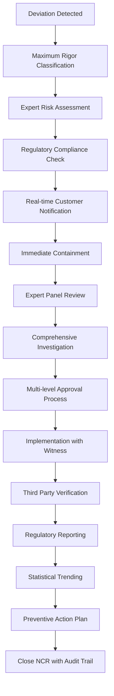

# EN 1090 Non-Conformance Report (NCR) Management System

**Document Version:** 1.0  
**Last Updated:** September 18, 2025  
**Scope:** Complete NCR deviation management for all EN 1090 execution classes

---

## Table of Contents

1. [Overview](#overview)
2. [NCR Management Framework](#ncr-management-framework)
3. [Execution Class Specific Requirements](#execution-class-specific-requirements)
4. [Deviation Categories and Classifications](#deviation-categories-and-classifications)
5. [NCR Workflow by Execution Class](#ncr-workflow-by-execution-class)
6. [Material Deviations](#material-deviations)
7. [Welding Deviations](#welding-deviations)
8. [Dimensional Deviations](#dimensional-deviations)
9. [Surface Treatment Deviations](#surface-treatment-deviations)
10. [Documentation Deviations](#documentation-deviations)
11. [Database Schema](#database-schema)
12. [User Interface Requirements](#user-interface-requirements)
13. [API Specifications](#api-specifications)
14. [Validation Rules](#validation-rules)
15. [Reporting and Analytics](#reporting-and-analytics)

---

## Overview

Non-Conformance Reports (NCRs) are critical components of the EN 1090 quality management system. They document deviations from specified requirements and ensure proper corrective actions are implemented. The severity and handling of NCRs vary significantly based on execution class requirements.

### Key Principles:
- **Systematic identification** of all deviations from specification
- **Risk-based classification** according to execution class
- **Traceable corrective actions** with verification
- **Customer notification** requirements for significant deviations
- **Statistical analysis** for continuous improvement

### Regulatory References:
- **EN 1090-2 Section 12:** Inspection, testing and corrective measures
- **EN ISO 9001:2015 Section 10:** Improvement and corrective action
- **EN 1090-1 Annex ZA:** Declaration of performance requirements

---

## NCR Management Framework

### NCR Lifecycle
All NCRs follow a standardized lifecycle regardless of execution class:

```
Detection → Classification → Investigation → Action → Verification → Closure
     ↓           ↓              ↓           ↓           ↓           ↓
  Who/What   Severity/Risk   Root Cause   Corrective   Effectiveness  Customer
  When/Where  Classification  Analysis     Action       Check        Acceptance
```

### Severity Classification Matrix

| Severity | Impact | EXC1 | EXC2 | EXC3 | EXC4 | Customer Notification |
|----------|--------|------|------|------|------|--------------------|
| **Critical** | Safety/Structural | Stop Production | Stop Production | Stop Production | Stop Production | Immediate |
| **Major** | Performance/Code | Continue with Review | Stop Production | Stop Production | Stop Production | Within 24h |
| **Minor** | Cosmetic/Process | Continue | Continue with Review | Continue with Review | Stop Production | Within 48h |
| **Observation** | Improvement | Log Only | Log Only | Continue | Continue with Review | Optional |

---

## Execution Class Specific Requirements

### EXC1 - Low Consequence Class

#### NCR Characteristics:
- **Simplified classification** - Major/Minor only
- **Basic documentation** requirements
- **Limited customer notification** (Major NCRs only)
- **Standard corrective actions** without extensive analysis

#### Deviation Thresholds:
```
Material Deviations:
✓ Certificate type: Any EN 10204 acceptable
✓ Dimensional tolerance: ±3mm for structural members
✓ Surface condition: Visual assessment acceptable
✓ Traceability: Lot-level tracking sufficient

Welding Deviations:
✓ Visual defects: Accept minor porosity, undercut <0.5mm
✓ Weld profile: ±2mm deviation acceptable
✓ Heat input: ±15% variation acceptable
✓ Preheat: Not mandatory for most applications

Quality Process:
✓ Inspection frequency: Sampling basis acceptable
✓ Documentation: Basic records sufficient
✓ Corrective action: Simple repair/rework
✓ Verification: Visual confirmation
```

**Database Implementation:**
```sql
-- EXC1 specific NCR fields
CREATE TABLE NCR_EXC1_Criteria (
    CriteriaId INT IDENTITY(1,1) PRIMARY KEY,
    DeviationType NVARCHAR(100) NOT NULL,
    AcceptableThreshold NVARCHAR(200),
    RequiredAction NVARCHAR(500),
    CustomerNotificationRequired BIT DEFAULT 0,
    ProcessingTimeHours INT DEFAULT 72
);

INSERT INTO NCR_EXC1_Criteria VALUES
('Dimensional Deviation', '±3mm for structural members', 'Measure and document, repair if >3mm', 0, 72),
('Weld Undercut', '<0.5mm depth', 'Visual inspection, repair if >0.5mm', 0, 48),
('Surface Defect', 'Cosmetic only', 'Document and assess impact', 0, 24),
('Material Certificate', 'EN 10204 2.1 minimum', 'Verify certificate validity', 1, 48);
```

---

### EXC2 - Medium Consequence Class

#### NCR Characteristics:
- **Enhanced classification** - Critical/Major/Minor/Observation
- **Detailed documentation** with root cause analysis for Major+ NCRs
- **Customer notification** required for Critical and Major NCRs
- **Structured corrective actions** with effectiveness verification

#### Deviation Thresholds:
```
Material Deviations:
✓ Certificate type: EN 10204 3.1 minimum required
✓ Dimensional tolerance: ±2mm for structural members
✓ Surface condition: Specific requirements per material type
✓ Traceability: Heat/batch number mandatory

Welding Deviations:
✓ Visual defects: Limited porosity, undercut <0.3mm
✓ Weld profile: ±1.5mm deviation acceptable
✓ Heat input: ±10% variation acceptable
✓ Preheat: Required per WPS specifications
✓ NDT: Penetrant testing for critical joints

Quality Process:
✓ Inspection frequency: Defined inspection points
✓ Documentation: Detailed records with signatures
✓ Corrective action: Formal investigation required
✓ Verification: Independent verification required
```

**Database Implementation:**
```sql
-- EXC2 enhanced NCR management
CREATE TABLE NCR_EXC2_Criteria (
    CriteriaId INT IDENTITY(1,1) PRIMARY KEY,
    DeviationType NVARCHAR(100) NOT NULL,
    CriticalThreshold NVARCHAR(200),
    MajorThreshold NVARCHAR(200),
    MinorThreshold NVARCHAR(200),
    RequiredNDT NVARCHAR(100),
    RootCauseAnalysisRequired BIT DEFAULT 1,
    CustomerNotificationHours INT DEFAULT 24,
    ProcessingTimeHours INT DEFAULT 48
);

INSERT INTO NCR_EXC2_Criteria VALUES
('Dimensional Deviation', '>5mm', '2-5mm', '<2mm', 'Visual + Measurement', 1, 24, 48),
('Weld Defect', 'Crack/Lack of Fusion', 'Undercut >0.3mm', 'Porosity <2%', 'PT/MT Required', 1, 4, 24),
('Material Traceability', 'No Certificate', 'Wrong Certificate Type', 'Minor Data Missing', 'Document Review', 1, 12, 24);
```

---

### EXC3 - High Consequence Class

#### NCR Characteristics:
- **Comprehensive classification** with risk assessment
- **Mandatory root cause analysis** for all NCRs except Observations
- **Immediate customer notification** for Critical NCRs
- **Statistical trending** and preventive action implementation

#### Deviation Thresholds:
```
Material Deviations:
✓ Certificate type: EN 10204 3.1 mandatory, 3.2 for critical applications
✓ Dimensional tolerance: ±1.5mm for structural members
✓ Surface condition: Specified quality levels with measurement
✓ Traceability: Complete heat genealogy required
✓ Chemical analysis: Verification testing required

Welding Deviations:
✓ Visual defects: Minimal porosity acceptable, no undercut >0.2mm
✓ Weld profile: ±1mm deviation maximum
✓ Heat input: ±5% variation acceptable
✓ Preheat: Mandatory per WPS with temperature recording
✓ NDT: PT/MT + RT/UT for critical joints (20% minimum)

Quality Process:
✓ Inspection frequency: 100% critical points, defined sampling
✓ Documentation: Complete traceability with digital records
✓ Corrective action: Formal investigation with containment
✓ Verification: Independent verification + customer review
```

**Database Implementation:**
```sql
-- EXC3 comprehensive NCR system
CREATE TABLE NCR_EXC3_Criteria (
    CriteriaId INT IDENTITY(1,1) PRIMARY KEY,
    DeviationType NVARCHAR(100) NOT NULL,
    RiskCategory NVARCHAR(50) NOT NULL,           -- Structural, Safety, Performance
    CriticalThreshold NVARCHAR(200),
    MajorThreshold NVARCHAR(200),
    MinorThreshold NVARCHAR(200),
    RequiredNDT NVARCHAR(200),
    ContainmentRequired BIT DEFAULT 1,
    StatisticalTrackingRequired BIT DEFAULT 1,
    CustomerApprovalRequired BIT DEFAULT 1,
    ProcessingTimeHours INT DEFAULT 24
);

-- Risk assessment for EXC3
CREATE TABLE NCR_EXC3_RiskAssessment (
    RiskAssessmentId INT IDENTITY(1,1) PRIMARY KEY,
    NCRId INT NOT NULL,
    ProbabilityScore INT NOT NULL,                -- 1-5 scale
    SeverityScore INT NOT NULL,                   -- 1-5 scale
    DetectionScore INT NOT NULL,                  -- 1-5 scale
    RiskPriorityNumber INT COMPUTED (ProbabilityScore * SeverityScore * DetectionScore),
    RiskLevel NVARCHAR(20) COMPUTED (
        CASE 
            WHEN (ProbabilityScore * SeverityScore * DetectionScore) > 50 THEN 'Critical'
            WHEN (ProbabilityScore * SeverityScore * DetectionScore) > 20 THEN 'High'
            WHEN (ProbabilityScore * SeverityScore * DetectionScore) > 8 THEN 'Medium'
            ELSE 'Low'
        END
    ),
    AssessedBy NVARCHAR(100) NOT NULL,
    AssessmentDate DATETIME2 DEFAULT GETDATE()
);
```

---

### EXC4 - Very High Consequence Class

#### NCR Characteristics:
- **Maximum rigor** in classification and handling
- **Mandatory risk assessment** for all NCRs
- **Real-time customer notification** for all NCRs
- **Comprehensive statistical analysis** and trend monitoring
- **Independent verification** by qualified third parties

#### Deviation Thresholds:
```
Material Deviations:
✓ Certificate type: EN 10204 3.2 mandatory for all materials
✓ Dimensional tolerance: ±1mm for structural members
✓ Surface condition: Specified Ra values with measurement records
✓ Traceability: Complete supply chain documentation
✓ Chemical analysis: Mandatory verification with retain samples
✓ Country of origin: Documented and verified

Welding Deviations:
✓ Visual defects: Zero tolerance for cracks, minimal porosity
✓ Weld profile: ±0.5mm deviation maximum
✓ Heat input: ±3% variation acceptable
✓ Preheat: Mandatory with continuous monitoring
✓ NDT: 100% RT/UT for critical joints, PT/MT for all joints
✓ Environmental: Temperature, humidity, wind speed recorded

Quality Process:
✓ Inspection frequency: 100% inspection at all control points
✓ Documentation: Complete digital records with timestamps
✓ Corrective action: Formal investigation with expert review
✓ Verification: Third-party verification + customer witness
```

**Database Implementation:**
```sql
-- EXC4 maximum rigor NCR system
CREATE TABLE NCR_EXC4_Criteria (
    CriteriaId INT IDENTITY(1,1) PRIMARY KEY,
    DeviationType NVARCHAR(100) NOT NULL,
    SafetyImpact NVARCHAR(50) NOT NULL,           -- Critical, High, Medium, Low
    EnvironmentalImpact NVARCHAR(50),
    EconomicImpact NVARCHAR(50),
    ZeroToleranceItem BIT DEFAULT 0,
    ThirdPartyVerificationRequired BIT DEFAULT 1,
    RegulatoryReportingRequired BIT DEFAULT 1,
    MaxProcessingTimeHours INT DEFAULT 12,
    EscalationRequired BIT DEFAULT 1
);

-- Comprehensive tracking for EXC4
CREATE TABLE NCR_EXC4_ExpertReview (
    ExpertReviewId INT IDENTITY(1,1) PRIMARY KEY,
    NCRId INT NOT NULL,
    ExpertName NVARCHAR(100) NOT NULL,
    ExpertQualification NVARCHAR(200) NOT NULL,
    ReviewDate DATE NOT NULL,
    RecommendedAction NVARCHAR(2000) NOT NULL,
    SafetyAssessment NVARCHAR(1000),
    RegulatoryCompliance NVARCHAR(1000),
    CustomerImpactAssessment NVARCHAR(1000),
    ApprovalStatus NVARCHAR(50) DEFAULT 'Under Review',
    DigitalSignature NVARCHAR(500),
    ReviewDocumentPath NVARCHAR(500)
);
```

---

## Deviation Categories and Classifications

### Material Deviations

#### Category: Chemical Composition
**EXC1 Deviations:**
```
Minor: Chemical composition within ±5% of specification
- Action: Document deviation, continue production
- Notification: None required
- Timeline: Log within 24 hours

Major: Chemical composition deviation >5% but within code limits
- Action: Evaluate structural impact, may continue with approval
- Notification: Customer notification within 48 hours
- Timeline: Resolution within 72 hours
```

**EXC2 Deviations:**
```
Minor: Chemical composition within ±3% of specification
Major: Chemical composition deviation 3-5% of specification
Critical: Chemical composition outside code limits
- Action: Stop production, full material requalification
- Notification: Immediate customer and regulatory notification
- Timeline: Resolution within 24 hours
```

**EXC3 Deviations:**
```
Minor: Chemical composition within ±2% of specification
Major: Chemical composition deviation 2-3% of specification
Critical: Any deviation affecting structural properties
- Action: Risk assessment, possible material replacement
- Notification: Real-time customer notification system
- Timeline: Resolution within 12 hours
```

**EXC4 Deviations:**
```
Observation: Chemical composition within ±1% of specification
Minor: Chemical composition deviation 1-1.5% of specification
Major: Chemical composition deviation >1.5%
Critical: Any deviation from exact specification
- Action: Complete requalification, expert review required
- Notification: Immediate multi-level customer notification
- Timeline: Resolution within 8 hours
```

#### Category: Mechanical Properties
**Database Schema:**
```sql
CREATE TABLE MaterialDeviations (
    MaterialDeviationId INT IDENTITY(1,1) PRIMARY KEY,
    NCRId INT NOT NULL,
    DeviationCategory NVARCHAR(100) NOT NULL,     -- Chemical, Mechanical, Dimensional
    PropertyName NVARCHAR(100) NOT NULL,          -- YieldStrength, TensileStrength, etc.
    SpecifiedValue DECIMAL(10,3) NOT NULL,
    ActualValue DECIMAL(10,3) NOT NULL,
    DeviationPercent DECIMAL(5,2) COMPUTED (
        ((ActualValue - SpecifiedValue) / SpecifiedValue) * 100
    ),
    ToleranceLimit DECIMAL(5,2) NOT NULL,
    ExecutionClass NVARCHAR(10) NOT NULL,
    SeverityLevel NVARCHAR(20) COMPUTED (
        CASE 
            WHEN ABS((ActualValue - SpecifiedValue) / SpecifiedValue * 100) <= ToleranceLimit THEN 'Minor'
            WHEN ABS((ActualValue - SpecifiedValue) / SpecifiedValue * 100) <= ToleranceLimit * 2 THEN 'Major'
            ELSE 'Critical'
        END
    ),
    ImpactAssessment NVARCHAR(1000),
    TestMethod NVARCHAR(100),
    TestCertificateNumber NVARCHAR(100),
    CONSTRAINT FK_MaterialDeviations_NCR 
        FOREIGN KEY (NCRId) REFERENCES NonConformanceReports(NCRId)
);
```

### Welding Deviations

#### Category: Weld Quality Defects
**Defect Classification by Execution Class:**

**Porosity:**
- **EXC1:** <4% area, individual pores <3mm diameter
- **EXC2:** <2% area, individual pores <2mm diameter  
- **EXC3:** <1% area, individual pores <1.5mm diameter
- **EXC4:** <0.5% area, individual pores <1mm diameter

**Undercut:**
- **EXC1:** <0.5mm depth, <25% weld length
- **EXC2:** <0.3mm depth, <15% weld length
- **EXC3:** <0.2mm depth, <10% weld length
- **EXC4:** <0.1mm depth, <5% weld length

**Database Implementation:**
```sql
CREATE TABLE WeldingDeviations (
    WeldingDeviationId INT IDENTITY(1,1) PRIMARY KEY,
    NCRId INT NOT NULL,
    WeldId NVARCHAR(50) NOT NULL,
    DefectType NVARCHAR(100) NOT NULL,            -- Porosity, Undercut, Crack, etc.
    DefectSize NVARCHAR(100),                     -- Dimensions or percentage
    DefectLocation NVARCHAR(200),                 -- Precise location description
    NDTMethod NVARCHAR(50),                       -- VT, PT, RT, UT
    AcceptanceCriteria NVARCHAR(200),
    AcceptanceLevel NVARCHAR(50),                 -- Per EN ISO 5817
    RepairMethod NVARCHAR(500),
    RepairRequired BIT DEFAULT 1,
    RepairCompleted BIT DEFAULT 0,
    RetestRequired BIT DEFAULT 1,
    FinalAcceptance BIT DEFAULT 0,
    WelderNotification BIT DEFAULT 1,             -- Inform welder for training
    CONSTRAINT FK_WeldingDeviations_NCR 
        FOREIGN KEY (NCRId) REFERENCES NonConformanceReports(NCRId)
);

-- Weld repair tracking
CREATE TABLE WeldRepairRecords (
    RepairRecordId INT IDENTITY(1,1) PRIMARY KEY,
    WeldingDeviationId INT NOT NULL,
    RepairMethod NVARCHAR(200) NOT NULL,
    RepairDate DATE NOT NULL,
    RepairedBy NVARCHAR(100) NOT NULL,
    RepairerQualification NVARCHAR(200),
    PreRepairPrep NVARCHAR(500),                  -- Grinding, cleaning, etc.
    RepairWPS NVARCHAR(100),                      -- WPS used for repair
    PostRepairNDT NVARCHAR(100),                  -- Required NDT after repair
    RepairInspectionResult NVARCHAR(50),
    InspectedBy NVARCHAR(100),
    InspectionDate DATE,
    CustomerApprovalRequired BIT DEFAULT 0,
    CustomerApprovalReceived BIT DEFAULT 0,
    RepairCost DECIMAL(10,2),
    CONSTRAINT FK_WeldRepair_WeldingDeviation 
        FOREIGN KEY (WeldingDeviationId) REFERENCES WeldingDeviations(WeldingDeviationId)
);
```

### Dimensional Deviations

#### Tolerance Requirements by Execution Class:
**Structural Member Dimensions:**
- **EXC1:** ±3mm for lengths, ±2mm for cross-sections
- **EXC2:** ±2mm for lengths, ±1.5mm for cross-sections
- **EXC3:** ±1.5mm for lengths, ±1mm for cross-sections
- **EXC4:** ±1mm for lengths, ±0.5mm for cross-sections

**Assembly Tolerances:**
- **Straightness:** L/1000 (EXC1), L/1250 (EXC2), L/1500 (EXC3), L/2000 (EXC4)
- **Squareness:** 2mm/m (EXC1), 1.5mm/m (EXC2), 1mm/m (EXC3), 0.5mm/m (EXC4)

```sql
CREATE TABLE DimensionalDeviations (
    DimensionalDeviationId INT IDENTITY(1,1) PRIMARY KEY,
    NCRId INT NOT NULL,
    AssemblyId INT,
    MeasurementType NVARCHAR(100) NOT NULL,       -- Length, Width, Height, Straightness
    SpecifiedDimension DECIMAL(10,3) NOT NULL,
    ActualDimension DECIMAL(10,3) NOT NULL,
    Deviation DECIMAL(10,3) COMPUTED (ActualDimension - SpecifiedDimension),
    ToleranceLimit DECIMAL(10,3) NOT NULL,
    MeasurementMethod NVARCHAR(100),              -- Tape, Laser, CMM
    MeasuredBy NVARCHAR(100) NOT NULL,
    MeasurementDate DATE NOT NULL,
    VerificationRequired BIT DEFAULT 1,
    VerifiedBy NVARCHAR(100),
    VerificationDate DATE,
    CorrectionMethod NVARCHAR(500),
    CorrectionCompleted BIT DEFAULT 0,
    FinalMeasurement DECIMAL(10,3),
    CONSTRAINT FK_DimensionalDeviations_NCR 
        FOREIGN KEY (NCRId) REFERENCES NonConformanceReports(NCRId)
);
```

---

## NCR Workflow by Execution Class

### EXC1 Workflow


### EXC2 Workflow


### EXC3 Workflow


### EXC4 Workflow


---

## Database Schema

### Core NCR Tables

```sql
-- Enhanced NCR main table
CREATE TABLE NonConformanceReports (
    NCRId INT IDENTITY(1,1) PRIMARY KEY,
    NCRNumber NVARCHAR(50) NOT NULL UNIQUE,
    ExecutionClass NVARCHAR(10) NOT NULL,
    TenantId UNIQUEIDENTIFIER NOT NULL,
    ProjectId INT,
    AssemblyId INT,
    MaterialId INT,
    ProcessId INT,
    
    -- Detection Information
    DetectedBy NVARCHAR(100) NOT NULL,
    DetectedDate DATETIME2 NOT NULL,
    DetectionMethod NVARCHAR(100),                -- Inspection, Testing, Customer Complaint
    
    -- Classification
    DeviationCategory NVARCHAR(100) NOT NULL,     -- Material, Welding, Dimensional, Process
    DeviationType NVARCHAR(100) NOT NULL,
    SeverityLevel NVARCHAR(20) NOT NULL,          -- Critical, Major, Minor, Observation
    RiskLevel NVARCHAR(20),                       -- High, Medium, Low (EXC3/4 only)
    
    -- Description
    Description NVARCHAR(2000) NOT NULL,
    ImpactAssessment NVARCHAR(2000),
    ImmediateAction NVARCHAR(1000),
    
    -- Analysis (Required for EXC2+)
    RootCauseAnalysis NVARCHAR(2000),
    ContributingFactors NVARCHAR(1000),
    WhyAnalysisLevel INT DEFAULT 0,               -- 5-Why analysis depth
    
    -- Actions
    CorrectiveAction NVARCHAR(2000),
    PreventiveAction NVARCHAR(2000),
    ResponsiblePerson NVARCHAR(100),
    TargetCloseDate DATE,
    ActualCloseDate DATE,
    
    -- Approval and Verification
    ApprovalRequired BIT DEFAULT 0,
    ApprovedBy NVARCHAR(100),
    ApprovalDate DATETIME2,
    VerificationRequired BIT DEFAULT 1,
    VerifiedBy NVARCHAR(100),
    VerificationDate DATETIME2,
    EffectivenessCheckRequired BIT DEFAULT 0,
    EffectivenessVerifiedBy NVARCHAR(100),
    EffectivenessVerificationDate DATETIME2,
    
    -- Customer Management
    CustomerNotificationRequired BIT DEFAULT 0,
    CustomerNotified BIT DEFAULT 0,
    CustomerNotificationDate DATETIME2,
    CustomerApprovalRequired BIT DEFAULT 0,
    CustomerApprovalReceived BIT DEFAULT 0,
    CustomerApprovalDate DATETIME2,
    CustomerFeedback NVARCHAR(1000),
    
    -- Financial Impact
    DirectCost DECIMAL(10,2) DEFAULT 0,
    IndirectCost DECIMAL(10,2) DEFAULT 0,
    CustomerClaims DECIMAL(10,2) DEFAULT 0,
    
    -- Status Management
    Status NVARCHAR(20) DEFAULT 'Open',           -- Open, In Progress, Pending Approval, Closed, Verified
    Priority NVARCHAR(20) DEFAULT 'Medium',       -- High, Medium, Low
    
    -- Audit Trail
    CreatedBy NVARCHAR(100) NOT NULL,
    CreatedDate DATETIME2 DEFAULT GETDATE(),
    ModifiedBy NVARCHAR(100),
    ModifiedDate DATETIME2,
    
    -- Indexes for performance
    INDEX IX_NCR_ExecutionClass (ExecutionClass),
    INDEX IX_NCR_TenantId (TenantId),
    INDEX IX_NCR_Status_Priority (Status, Priority),
    INDEX IX_NCR_DetectedDate (DetectedDate DESC),
    INDEX IX_NCR_SeverityLevel (SeverityLevel)
);

-- NCR attachments and evidence
CREATE TABLE NCRAttachments (
    AttachmentId INT IDENTITY(1,1) PRIMARY KEY,
    NCRId INT NOT NULL,
    AttachmentType NVARCHAR(50) NOT NULL,         -- Photo, Document, Test Report, Drawing
    FileName NVARCHAR(255) NOT NULL,
    FilePath NVARCHAR(500) NOT NULL,
    FileSize BIGINT,
    MimeType NVARCHAR(100),
    Description NVARCHAR(500),
    UploadedBy NVARCHAR(100) NOT NULL,
    UploadedDate DATETIME2 DEFAULT GETDATE(),
    IsEvidence BIT DEFAULT 1,                     -- Evidence vs supporting document
    CONSTRAINT FK_NCRAttachments_NCR 
        FOREIGN KEY (NCRId) REFERENCES NonConformanceReports(NCRId) ON DELETE CASCADE
);

-- NCR action tracking
CREATE TABLE NCRActions (
    ActionId INT IDENTITY(1,1) PRIMARY KEY,
    NCRId INT NOT NULL,
    ActionType NVARCHAR(50) NOT NULL,             -- Immediate, Corrective, Preventive
    ActionDescription NVARCHAR(1000) NOT NULL,
    ResponsiblePerson NVARCHAR(100) NOT NULL,
    TargetDate DATE NOT NULL,
    ActualCompletionDate DATE,
    Status NVARCHAR(20) DEFAULT 'Assigned',       -- Assigned, In Progress, Completed, Verified
    VerificationMethod NVARCHAR(200),
    VerifiedBy NVARCHAR(100),
    VerificationDate DATE,
    EffectivenessRating INT,                      -- 1-5 scale
    Cost DECIMAL(10,2),
    Notes NVARCHAR(1000),
    CONSTRAINT FK_NCRActions_NCR 
        FOREIGN KEY (NCRId) REFERENCES NonConformanceReports(NCRId) ON DELETE CASCADE
);

-- Statistical tracking for continuous improvement
CREATE TABLE NCRStatistics (
    StatisticId INT IDENTITY(1,1) PRIMARY KEY,
    TenantId UNIQUEIDENTIFIER NOT NULL,
    ExecutionClass NVARCHAR(10) NOT NULL,
    ReportingPeriod NVARCHAR(7) NOT NULL,         -- YYYY-MM format
    DeviationCategory NVARCHAR(100) NOT NULL,
    TotalNCRs INT NOT NULL DEFAULT 0,
    CriticalNCRs INT NOT NULL DEFAULT 0,
    MajorNCRs INT NOT NULL DEFAULT 0,
    MinorNCRs INT NOT NULL DEFAULT 0,
    ObservationNCRs INT NOT NULL DEFAULT 0,
    AverageResolutionDays DECIMAL(5,2),
    CustomerNotifications INT NOT NULL DEFAULT 0,
    RepeatNCRs INT NOT NULL DEFAULT 0,            -- Same root cause
    TotalCost DECIMAL(12,2) DEFAULT 0,
    CalculatedDate DATETIME2 DEFAULT GETDATE(),
    
    UNIQUE (TenantId, ExecutionClass, ReportingPeriod, DeviationCategory)
);
```

---

## User Interface Requirements

### NCR Dashboard Requirements

#### Executive Dashboard
```
EXC Class Overview:
✓ Open NCRs by execution class and severity
✓ NCR trends by month with statistical analysis
✓ Cost impact analysis with budget variance
✓ Customer notification status and response times
✓ Top root causes with frequency analysis
✓ Repeat NCR identification and prevention status

Key Performance Indicators:
✓ NCR resolution time by execution class
✓ First-time fix rate percentage
✓ Customer satisfaction scores
✓ Prevention effectiveness metrics
```

#### Quality Manager Dashboard
```
Active NCR Management:
✓ NCRs requiring immediate attention by priority
✓ Overdue NCRs with escalation alerts
✓ Pending customer approvals with deadlines
✓ Verification tasks assigned to quality team
✓ Statistical trends requiring preventive action

Process Monitoring:
✓ NCR workflow status with bottleneck identification
✓ Resource allocation for corrective actions
✓ Training needs based on repeat deviations
✓ Supplier-related NCRs requiring attention
```

#### Production Dashboard
```
Real-time NCR Status:
✓ Production holds due to critical NCRs
✓ Work instructions affected by open NCRs
✓ Material quarantine status
✓ Assembly progression blocked by NCRs
✓ Immediate actions requiring shop floor attention

Worker Notifications:
✓ NCRs affecting current work assignments
✓ Process changes due to preventive actions
✓ Training requirements from NCR analysis
✓ Quality alerts for specific operations
```

### NCR Form Requirements

#### NCR Creation Form (Varies by Execution Class)
```html
<!-- EXC1 Basic Form -->
<form class="ncr-form-exc1">
    <section class="detection-info">
        <input type="text" id="detectedBy" placeholder="Detected By" required>
        <input type="datetime-local" id="detectedDate" required>
        <select id="deviationType">
            <option>Material Deviation</option>
            <option>Welding Defect</option>
            <option>Dimensional Issue</option>
            <option>Process Deviation</option>
        </select>
    </section>
    
    <section class="severity-classification">
        <select id="severityLevel">
            <option value="Major">Major - Customer notification required</option>
            <option value="Minor">Minor - Internal handling only</option>
        </select>
    </section>
    
    <section class="description">
        <textarea id="description" placeholder="Describe the deviation..." required></textarea>
        <textarea id="immediateAction" placeholder="Immediate action taken..."></textarea>
    </section>
</form>

<!-- EXC4 Comprehensive Form -->
<form class="ncr-form-exc4">
    <section class="detection-info">
        <!-- Basic detection info plus environmental conditions -->
        <input type="number" id="ambientTemp" placeholder="Ambient Temperature (°C)">
        <input type="number" id="humidity" placeholder="Humidity (%)">
        <input type="text" id="detectionMethod" placeholder="Detection Method">
    </section>
    
    <section class="risk-assessment">
        <select id="safetyImpact" required>
            <option value="Critical">Critical - Immediate safety concern</option>
            <option value="High">High - Potential safety impact</option>
            <option value="Medium">Medium - Limited safety impact</option>
            <option value="Low">Low - No safety impact</option>
        </select>
        
        <select id="environmentalImpact">
            <option value="High">High - Environmental concern</option>
            <option value="Medium">Medium - Potential impact</option>
            <option value="Low">Low - Minimal impact</option>
            <option value="None">None - No environmental impact</option>
        </select>
    </section>
    
    <section class="expert-review">
        <input type="text" id="expertRequired" placeholder="Expert Review Required">
        <select id="thirdPartyVerification">
            <option value="Required">Third Party Verification Required</option>
            <option value="Recommended">Third Party Verification Recommended</option>
            <option value="Not Required">Third Party Verification Not Required</option>
        </select>
    </section>
</form>
```

---

## API Specifications

### RESTful API Endpoints

#### NCR Management APIs
```http
# Create NCR (varies by execution class)
POST /api/ncr/create
Content-Type: application/json
{
    "executionClass": "EXC3",
    "deviationType": "Welding Defect",
    "severity": "Major",
    "description": "Undercut exceeding tolerance",
    "detectedBy": "John Smith",
    "projectId": 123,
    "assemblyId": 456
}

# Get NCRs with filtering
GET /api/ncr?executionClass=EXC3&status=Open&severity=Critical
GET /api/ncr?tenantId={guid}&dateFrom=2025-09-01&dateTo=2025-09-18

# Update NCR workflow
PUT /api/ncr/{ncrId}/status
{
    "status": "In Progress",
    "updatedBy": "Jane Doe",
    "notes": "Root cause analysis initiated"
}

# Customer notification
POST /api/ncr/{ncrId}/notify-customer
{
    "notificationMethod": "Email",
    "urgency": "High",
    "customMessage": "Critical deviation requiring immediate attention"
}

# Statistical analysis
GET /api/ncr/statistics?period=2025-09&executionClass=EXC3
GET /api/ncr/trends?category=Welding&months=6

# Expert review (EXC4 only)
POST /api/ncr/{ncrId}/expert-review
{
    "expertName": "Dr. Smith",
    "qualification": "Welding Engineer Level III",
    "recommendedAction": "Complete weld repair and re-test",
    "safetyAssessment": "No immediate safety concern after repair"
}
```

#### Approval Workflow APIs
```http
# Submit for approval
POST /api/ncr/{ncrId}/submit-approval
{
    "approverRole": "Quality Manager",
    "approvalType": "Corrective Action",
    "supportingDocuments": ["doc1.pdf", "photo1.jpg"]
}

# Approve/Reject NCR actions
PUT /api/ncr/{ncrId}/approve
{
    "approved": true,
    "approverComments": "Approved with condition to monitor for 30 days",
    "conditions": ["Monitor for recurrence", "Update work instruction"]
}
```

---

## Validation Rules

### Execution Class Specific Validation

```csharp
public static class NCRValidationRules
{
    public static ValidationResult ValidateNCRByExecutionClass(NCRCreateRequest request)
    {
        var result = new ValidationResult();
        
        switch (request.ExecutionClass)
        {
            case ExecutionClass.EXC1:
                result = ValidateEXC1Requirements(request);
                break;
            case ExecutionClass.EXC2:
                result = ValidateEXC2Requirements(request);
                break;
            case ExecutionClass.EXC3:
                result = ValidateEXC3Requirements(request);
                break;
            case ExecutionClass.EXC4:
                result = ValidateEXC4Requirements(request);
                break;
        }
        
        return result;
    }
    
    private static ValidationResult ValidateEXC1Requirements(NCRCreateRequest request)
    {
        var result = new ValidationResult();
        
        // Basic validation for EXC1
        if (string.IsNullOrEmpty(request.Description))
            result.AddError("Description is required");
            
        if (request.Severity == "Critical")
            result.AddError("EXC1 does not support Critical severity classification");
            
        return result;
    }
    
    private static ValidationResult ValidateEXC4Requirements(NCRCreateRequest request)
    {
        var result = new ValidationResult();
        
        // Comprehensive validation for EXC4
        if (string.IsNullOrEmpty(request.Description))
            result.AddError("Detailed description is mandatory for EXC4");
            
        if (string.IsNullOrEmpty(request.SafetyImpact))
            result.AddError("Safety impact assessment is mandatory for EXC4");
            
        if (string.IsNullOrEmpty(request.EnvironmentalImpact))
            result.AddError("Environmental impact assessment is mandatory for EXC4");
            
        if (request.Severity == "Critical" && string.IsNullOrEmpty(request.ExpertReviewRequired))
            result.AddError("Expert review is mandatory for Critical NCRs in EXC4");
            
        // Immediate notification required for all EXC4 NCRs
        if (!request.CustomerNotificationRequired)
            result.AddWarning("Customer notification is recommended for all EXC4 NCRs");
            
        return result;
    }
}

// Severity classification validation
public static class SeverityClassificationRules
{
    public static string DetermineSeverity(string deviationType, decimal deviationValue, 
        ExecutionClass executionClass)
    {
        var thresholds = GetThresholdsForExecutionClass(executionClass);
        
        return deviationType switch
        {
            "Dimensional Deviation" => ClassifyDimensionalDeviation(deviationValue, thresholds),
            "Weld Undercut" => ClassifyWeldDefect(deviationValue, thresholds),
            "Material Property" => ClassifyMaterialDeviation(deviationValue, thresholds),
            _ => "Minor"
        };
    }
    
    private static Dictionary<string, decimal> GetThresholdsForExecutionClass(ExecutionClass execClass)
    {
        return execClass switch
        {
            ExecutionClass.EXC1 => new Dictionary<string, decimal> 
            { 
                { "MinorThreshold", 3.0m }, 
                { "MajorThreshold", 5.0m } 
            },
            ExecutionClass.EXC4 => new Dictionary<string, decimal> 
            { 
                { "MinorThreshold", 0.5m }, 
                { "MajorThreshold", 1.0m }, 
                { "CriticalThreshold", 1.5m } 
            },
            _ => new Dictionary<string, decimal>()
        };
    }
}
```

---

## Reporting and Analytics

### Statistical Reports by Execution Class

#### NCR Trend Analysis
```sql
-- Monthly NCR trends by execution class
CREATE VIEW NCR_Monthly_Trends AS
SELECT 
    t.Name AS TenantName,
    n.ExecutionClass,
    FORMAT(n.DetectedDate, 'yyyy-MM') AS ReportingMonth,
    COUNT(*) AS TotalNCRs,
    SUM(CASE WHEN n.SeverityLevel = 'Critical' THEN 1 ELSE 0 END) AS CriticalNCRs,
    SUM(CASE WHEN n.SeverityLevel = 'Major' THEN 1 ELSE 0 END) AS MajorNCRs,
    SUM(CASE WHEN n.SeverityLevel = 'Minor' THEN 1 ELSE 0 END) AS MinorNCRs,
    AVG(DATEDIFF(day, n.DetectedDate, n.ActualCloseDate)) AS AvgResolutionDays,
    SUM(n.DirectCost + n.IndirectCost) AS TotalCost,
    COUNT(CASE WHEN n.CustomerNotified = 1 THEN 1 END) AS CustomerNotifications
FROM NonConformanceReports n
INNER JOIN Tenants t ON n.TenantId = t.TenantId
WHERE n.ActualCloseDate IS NOT NULL
GROUP BY t.Name, n.ExecutionClass, FORMAT(n.DetectedDate, 'yyyy-MM');

-- Root cause analysis by execution class
CREATE VIEW NCR_Root_Cause_Analysis AS
SELECT 
    ExecutionClass,
    DeviationCategory,
    COUNT(*) AS Frequency,
    AVG(DATEDIFF(day, DetectedDate, ActualCloseDate)) AS AvgResolutionTime,
    SUM(DirectCost + IndirectCost) AS TotalImpactCost,
    COUNT(CASE WHEN Status = 'Closed' AND 
        EXISTS(SELECT 1 FROM NonConformanceReports n2 
               WHERE n2.RootCauseAnalysis = n1.RootCauseAnalysis 
               AND n2.DetectedDate > n1.ActualCloseDate) 
        THEN 1 END) AS RepeatOccurrences
FROM NonConformanceReports n1
WHERE RootCauseAnalysis IS NOT NULL
GROUP BY ExecutionClass, DeviationCategory
ORDER BY Frequency DESC;
```

#### Key Performance Indicators (KPIs)
```sql
-- NCR KPIs by execution class
CREATE VIEW NCR_KPIs AS
SELECT 
    ExecutionClass,
    -- Resolution Time KPIs
    AVG(CASE WHEN SeverityLevel = 'Critical' 
        THEN DATEDIFF(hour, DetectedDate, ActualCloseDate) END) AS CriticalAvgHours,
    AVG(CASE WHEN SeverityLevel = 'Major' 
        THEN DATEDIFF(hour, DetectedDate, ActualCloseDate) END) AS MajorAvgHours,
    
    -- Quality KPIs
    (COUNT(CASE WHEN EffectivenessVerificationDate IS NOT NULL THEN 1 END) * 100.0 / 
     COUNT(*)) AS EffectivenessVerificationRate,
    
    -- Customer Impact KPIs
    (COUNT(CASE WHEN CustomerNotificationRequired = 1 AND CustomerNotified = 1 THEN 1 END) * 100.0 /
     COUNT(CASE WHEN CustomerNotificationRequired = 1 THEN 1 END)) AS CustomerNotificationComplianceRate,
     
    -- Cost KPIs
    AVG(DirectCost + IndirectCost) AS AverageCostPerNCR,
    SUM(DirectCost + IndirectCost) AS TotalCostImpact,
    
    -- Prevention KPIs
    (COUNT(CASE WHEN PreventiveAction IS NOT NULL AND PreventiveAction != '' THEN 1 END) * 100.0 /
     COUNT(*)) AS PreventiveActionRate
     
FROM NonConformanceReports
WHERE ActualCloseDate IS NOT NULL
GROUP BY ExecutionClass;
```

### Dashboard Visualizations

#### Executive Summary Dashboard
```javascript
// NCR Overview Widget for Executive Dashboard
const ncrOverviewData = {
    executionClasses: ['EXC1', 'EXC2', 'EXC3', 'EXC4'],
    datasets: [
        {
            label: 'Open NCRs',
            data: [12, 8, 15, 3],
            backgroundColor: 'rgba(255, 99, 132, 0.6)'
        },
        {
            label: 'Critical NCRs',
            data: [0, 1, 3, 2],
            backgroundColor: 'rgba(255, 0, 0, 0.8)'
        }
    ]
};

// Trend Analysis Chart
const trendData = {
    labels: ['Jan 2025', 'Feb 2025', 'Mar 2025', 'Apr 2025', 'May 2025', 'Jun 2025'],
    datasets: [
        {
            label: 'EXC1 NCRs',
            data: [8, 6, 9, 12, 7, 10],
            borderColor: 'rgb(75, 192, 192)',
            tension: 0.1
        },
        {
            label: 'EXC4 NCRs',
            data: [2, 3, 1, 4, 2, 3],
            borderColor: 'rgb(255, 0, 0)',
            tension: 0.1
        }
    ]
};
```

---

## Conclusion

This comprehensive NCR management system provides complete deviation handling for all EN 1090 execution classes. The implementation ensures:

### Key Benefits:
1. **Execution Class Compliance** - Tailored NCR handling for each EXC level
2. **Systematic Deviation Management** - Complete workflow from detection to closure
3. **Customer Communication** - Automated notification and approval processes
4. **Statistical Analysis** - Trend identification and prevention opportunities
5. **Regulatory Compliance** - Full audit trail and documentation requirements

### Implementation Priority:
1. **Phase 1:** Core NCR database schema and basic workflow (EXC1/EXC2)
2. **Phase 2:** Advanced features for EXC3 including risk assessment
3. **Phase 3:** Maximum rigor EXC4 implementation with expert review system

### Success Metrics:
- **Resolution Time:** Meeting execution class specific deadlines
- **Customer Satisfaction:** Timely notification and resolution
- **Prevention Effectiveness:** Reduction in repeat NCRs
- **Cost Control:** Minimizing impact through rapid resolution

This NCR system positions Manimp as the most comprehensive EN 1090 compliant platform available, providing manufacturers with the tools needed to maintain the highest quality standards across all execution classes.

---

*This NCR management specification should be updated as EN 1090 requirements evolve and operational experience provides insights for continuous improvement.*